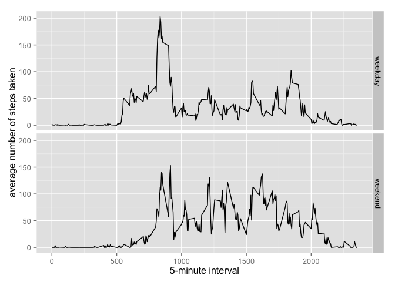

# Reproducible Research: Peer Assessment 1


## Loading and preprocessing the data

Load the data

```r
unzip(zipfile="activity.zip")
data <- read.csv("activity.csv")
```

## What is mean total number of steps taken per day?
Make a histogram of the total number of steps taken each day

```r
total.by.day <- tapply(data$steps, data$date, sum, na.rm = T)
hist(total.by.day, breaks = 50,
     main = "Histogram of the total number of steps taken each day")
```

 

Calculate and report the mean and median total number of steps taken per day

```r
mean(total.by.day, na.rm = T)
```

```
## [1] 9354
```

```r
median(total.by.day, na.rm = T)
```

```
## [1] 10395
```

## What is the average daily activity pattern?
Make a time series plot of the 5-minute interval (x-axis) and the average number of steps taken, averaged across all days (y-axis)

```r
averages <- aggregate(data$steps, by=list(data$interval), FUN=mean, na.rm=TRUE)
names(averages) <- c("interval", "steps")
plot(averages, type="l",xlab = "5-minute interval", ylab = "average number of steps taken")
```

 

Which 5-minute interval, on average across all the days in the dataset, contains the maximum number of steps?


```r
averages[which.max(averages$steps),]
```

```
##     interval steps
## 104      835 206.2
```

## Imputing missing values
Calculate and report the total number of missing values in the dataset

```r
sum(is.na(data$steps))
```

```
## [1] 2304
```

Fill the missing value with the mean value of its 5-minute interval

```r
means <- tapply(data$steps, data$date, mean, na.rm = T)
fill <- function(step, date) {
  if (is.na(step)) {
    value = means[date]
    # date like 2012-11-04, there is no steps records, 
    # and make value of `mean` to be NaN, ignore this situation
    ifelse(is.nan(value), 0, value)
  } else {
    step
  }
}
steps <- mapply(fill, data$steps, data$date)
```

Create a new dataset that is equal to the original dataset but with the missing data filled in.

```r
newdata <- data
newdata$steps <- steps
```

After missing value filled, there mean/median, and distribution doesn't change

```r
total.by.day1 <- tapply(newdata$steps, data$date, sum, na.rm = T)

mean(total.by.day1, na.rm = T)
```

```
## [1] 9354
```

```r
median(total.by.day1, na.rm = T)
```

```
## [1] 10395
```

```r
par(mfrow=c(2, 1))
hist(total.by.day, breaks = 50,
     main = "Histogram of the total number of steps taken each day")
hist(total.by.day1, breaks = 50,
     main = "Histogram of the total number of steps taken each day with missing value filled")
```

 

```r
par(mfrow=c(1, 1))
```

## Are there differences in activity patterns between weekdays and weekends?
Create a new factor variable in the dataset with two levels – “weekday” and “weekend” indicating whether a given date is a weekday or weekend day.

```r
week.label <- function (date) {
  day <- weekdays(as.Date(date))
  ifelse (day %in% c("Saturday", "Sunday"), "weekend", "weekday")
}
newdata$week <- week.label(newdata$date)
```

Make a panel plot containing a time series plot

```r
library(ggplot2)

averages <- aggregate(steps ~ interval + week, data=newdata, mean)
ggplot(averages, aes(interval, steps)) + geom_line() + facet_grid(week ~ .) +
    xlab("5-minute interval") + ylab("average number of steps taken")
```

 
